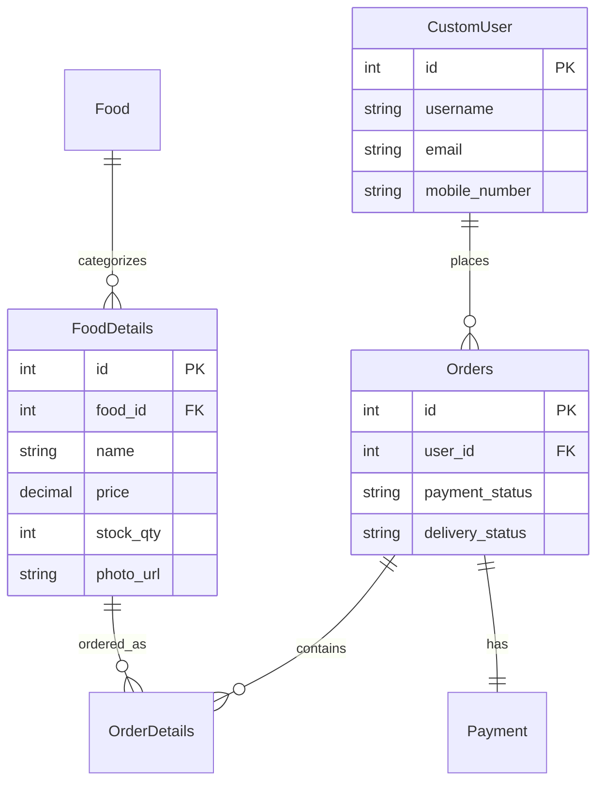

# 🍽️ Canteen Management System

A modern, full-stack Django web application for managing canteen operations with integrated payment processing, real-time order tracking, and comprehensive administrative controls.

[](https://www.djangoproject.com/)
[](https://www.python.org/)
[](https://www.postgresql.org/)
[](https://www.docker.com/)
[](https://www.django-rest-framework.org/)
[](https://razorpay.com/)
[](LICENSE)

> **Perfect for**: Educational institutions, corporate cafeterias, food courts, and small restaurants looking for a complete digital ordering solution.

## 📋 Table of Contents

- [🚀 Quick Start](#-quick-start)
- [✨ Features](#-features)
- [🛠️ Tech Stack](#-tech-stack)
- [📁 Project Architecture](#-project-architecture)
- [⚡ Installation](#-installation)
- [⚙️ Configuration](#-configuration)
- [🌱 Database Setup](#-database-setup)
- [📡 API Documentation](#-api-documentation)
- [💻 Usage Guide](#-usage-guide)
- [🔐 Admin Panel](#-admin-panel)
- [💳 Payment Integration](#-payment-integration)
- [🤝 Contributing](#-contributing)
- [🧪 Testing](#-testing)
- [🚀 Deployment](#-deployment)
- [🐛 Troubleshooting](#-troubleshooting)
- [📚 Additional Resources](#-additional-resources)

## 🚀 Quick Start

Get up and running in under 5 minutes:

```bash
# Clone and setup
git clone https://github.com/lakhman108/Canteen.git
cd Canteen

# Using Docker (Recommended)
cp .env.example .env
docker-compose up --build

# Access at http://localhost:8000
```

## ✨ Features

### 🛒 Customer Features
- **User Authentication**: Secure registration and login system
- **Browse Menu**: View food items with categories, images, prices, and ratings
- **Filter by Category**: Browse items by cuisine type (Gujarati, Punjabi, Chinese, South Indian, Snacks)
- **Shopping Cart**: Add/remove items, adjust quantities, real-time stock validation
- **Payment Processing**: Integrated Razorpay payment gateway
- **Order Tracking**: Real-time order status updates
- **Responsive Design**: Mobile-friendly interface

### 👨‍💼 Admin Features
- **Order Management**: View pending orders, mark items as delivered
- **Inventory Management**: Add/update food items and categories
- **Real-time Dashboard**: Monitor active orders and delivery status
- **Stock Management**: Track and update stock quantities
- **User Management**: View and manage customer accounts

### 🔧 Technical Features
- **RESTful API**: Complete API for all operations
- **Database Optimization**: Query optimization with select_related and prefetch_related
- **Docker Support**: Containerized deployment with Docker Compose
- **Database Seeding**: CSV-based data import for easy setup
- **Payment Verification**: Razorpay signature verification
- **Session Management**: Secure user sessions
- **Error Handling**: Comprehensive error handling and user feedback

## 🛠️ Tech Stack

### Backend
- **Framework**: Django 4.1.13
- **API**: Django REST Framework 3.15.1
- **Database**: PostgreSQL 15
- **ORM**: Django ORM
- **Server**: Gunicorn 22.0.0

### Frontend
- **Template Engine**: Django Templates
- **Styling**: CSS, Bootstrap (via templates)
- **JavaScript**: Vanilla JS for dynamic interactions

### Payment & Integration
- **Payment Gateway**: Razorpay 1.4.2
- **HTTP Client**: Requests 2.32.0

### DevOps & Deployment
- **Containerization**: Docker & Docker Compose
- **Static Files**: WhiteNoise 6.6.0
- **Environment Management**: python-dotenv 1.0.1

## 📁 Project Architecture

### 🏗️ High-Level Architecture

```
┌─────────────────┐    ┌─────────────────┐    ┌─────────────────┐
│   Frontend      │    │   Backend       │    │   Database      │
│   (Templates)   │◄──►│   (Django)      │◄──►│   (PostgreSQL)  │
└─────────────────┘    └─────────────────┘    └─────────────────┘
                              │
                              ▼
                       ┌─────────────────┐
                       │   Payment       │
                       │   (Razorpay)    │
                       └─────────────────┘
```

### 📂 Directory Structure

```
Canteen/
├── 🏠 Core Applications
│   ├── canteen/                    # Main business logic
│   │   ├── management/commands/    # Custom Django commands
│   │   │   └── seed_data.py       # Database seeding
│   │   ├── models.py              # Core models (User, Orders, Food)
│   │   ├── views.py               # Customer-facing views
│   │   ├── urls.py                # URL routing
│   │   └── forms.py               # Django forms
│   ├── admin_panel/               # Administrative interface
│   │   ├── views.py               # Admin dashboard views
│   │   └── urls.py                # Admin URL patterns
│   └── database/                  # REST API layer
│       ├── serializers.py         # DRF serializers
│       ├── views.py               # API ViewSets
│       └── urls.py                # API endpoints
│
├── ⚙️ Configuration
│   ├── vercel_app/                # Django project settings
│   │   ├── settings.py            # Environment-based config
│   │   ├── urls.py                # Main URL routing
│   │   └── wsgi.py                # WSGI application
│   └── .env.example               # Environment template
│
├── 🎨 Frontend Assets
│   ├── templates/                 # Django HTML templates
│   │   ├── base.html              # Base template
│   │   ├── index.html             # Menu display
│   │   ├── cart.html              # Shopping cart
│   │   └── payment.html           # Payment interface
│   └── static/                    # CSS, JS, images
│
├── 🗄️ Data & Deployment
│   ├── canteen_food.csv           # Food categories seed data
│   ├── canteen_fooddetails.csv    # Food items seed data
│   ├── Dockerfile                 # Multi-stage container build
│   ├── docker-compose.yml         # Local development setup
│   └── docker-entrypoint.sh       # Container initialization
│
└── 📋 Documentation
    ├── requirements.txt           # Python dependencies
    └── README.md                  # This documentation
```

### 🔄 Data Flow

1. **Customer Journey**: Templates → Views → Models → Database
2. **Admin Operations**: Admin Panel → API → Database
3. **Payment Processing**: Frontend → Razorpay → Webhook → Database
4. **API Access**: External → DRF ViewSets → Serializers → Models

## 📦 Prerequisites

### 🐳 Docker Setup (Recommended)
- **Docker**: 20.10+ ([Install Guide](https://docs.docker.com/get-docker/))
- **Docker Compose**: 2.0+ (included with Docker Desktop)

### 🐍 Local Development
- **Python**: 3.9+ ([Download](https://www.python.org/downloads/))
- **PostgreSQL**: 15+ ([Install Guide](https://www.postgresql.org/download/))
- **pip**: Latest version (`python -m pip install --upgrade pip`)

### 💳 Payment Gateway (Optional)
- **Razorpay Account**: [Sign up](https://dashboard.razorpay.com/signup) for API keys

## ⚡ Installation

### 🐳 Docker Setup (Recommended for Beginners)

**One-command setup:**
```bash
git clone https://github.com/lakhman108/Canteen.git
cd Canteen
cp .env.example .env
docker-compose up --build
```

**Access your application:**
- 🌐 **Main Site**: http://localhost:8000
- 👨‍💼 **Admin Panel**: http://localhost:8000/admin
- 📡 **API Docs**: http://localhost:8000/api

### 🐍 Local Development Setup

**Step 1: Clone and Setup**
```bash
git clone https://github.com/lakhman108/Canteen.git
cd Canteen

# Create virtual environment
python -m venv venv
source venv/bin/activate  # Windows: venv\Scripts\activate

# Install dependencies
pip install -r requirements.txt
```

**Step 2: Database Configuration**
```bash
# Create PostgreSQL database
createdb canteen_db

# Or using psql
psql -U postgres -c "CREATE DATABASE canteen_db;"
```

**Step 3: Environment Setup**
```bash
cp .env.example .env
# Edit .env with your database credentials
```

**Step 4: Initialize Application**
```bash
# Run migrations
python manage.py migrate

# Create admin user
python manage.py createsuperuser

# Seed sample data (optional)
python manage.py seed_data

# Collect static files
python manage.py collectstatic --noinput
```

**Step 5: Launch**
```bash
python manage.py runserver
# Visit http://localhost:8000
```

### 🔧 Development Commands

```bash
# Database operations
python manage.py makemigrations    # Create new migrations
python manage.py migrate          # Apply migrations
python manage.py seed_data        # Load sample data

# User management
python manage.py createsuperuser  # Create admin user
python manage.py shell           # Django shell

# Static files
python manage.py collectstatic    # Collect static files

# Docker operations
docker-compose up --build        # Build and start
docker-compose down              # Stop containers
docker-compose logs -f web       # View logs
```

## ⚙️ Configuration

### 🔐 Environment Variables

Copy `.env.example` to `.env` and configure:

```bash
cp .env.example .env
```

**Essential Configuration:**
```env
# 🔑 Security (REQUIRED)
SECRET_KEY=your-super-secret-key-change-this-in-production
DEBUG=False
ALLOWED_HOSTS=localhost,127.0.0.1,yourdomain.com

# 🗄️ Database (REQUIRED)
DB_NAME=canteen_db
DB_USER=postgres
DB_PASSWORD=your-secure-password
DB_HOST=localhost  # or your database host
DB_PORT=5432

# 💳 Payment Gateway (OPTIONAL)
RAZORPAY_KEY_ID=rzp_test_xxxxxxxxxxxxx
RAZORPAY_KEY_SECRET=your_razorpay_secret

# 🚀 Deployment Options (OPTIONAL)
CREATE_SUPERUSER=false    # Auto-create admin user
SEED_DATABASE=false       # Auto-load sample data
BASE_URL=http://localhost:8000
```

### 🗄️ Database Options

| Environment | Configuration | Notes |
|-------------|---------------|-------|
| **Local Development** | `DB_HOST=localhost` | Install PostgreSQL locally |
| **Docker** | Uses external DB | Configure external PostgreSQL |
| **Cloud (AWS RDS)** | `DB_HOST=your-rds-endpoint` | Use managed database |
| **Cloud (Heroku)** | `DATABASE_URL` | Automatic configuration |

### 🔧 Advanced Settings

**Storage Configuration:**
```env
# Local storage (default)
USE_S3=False

# S3/MinIO storage
USE_S3=True
AWS_ACCESS_KEY_ID=your-access-key
AWS_SECRET_ACCESS_KEY=your-secret-key
AWS_STORAGE_BUCKET_NAME=canteen-media
AWS_S3_ENDPOINT_URL=https://your-s3-endpoint.com
```

## 🌱 Database Setup

### 📊 Database Schema Overview



### 🌱 Sample Data Loading

**Included Sample Data:**
- 📁 `canteen_food.csv`: 5 food categories (Gujarati, Punjabi, Chinese, South Indian, Snacks)
- 📁 `canteen_fooddetails.csv`: Sample food items with prices and images

**Loading Methods:**

```bash
# Method 1: Manual command
python manage.py seed_data

# Method 2: Auto-load with Docker
# Set SEED_DATABASE=true in .env
docker-compose up --build

# Method 3: Inside running container
docker-compose exec web python manage.py seed_data
```

**Custom Data:**
Replace CSV files with your own data following the same format:

```csv
# canteen_food.csv
id,name
1,Italian_items
2,Mexican_items

# canteen_fooddetails.csv
id,name,stock_qty,price,photo_url,food_id,rating
1,Pizza Margherita,50,12.99,https://example.com/pizza.jpg,1,5
```

## 📡 API Documentation

The application provides a RESTful API for all major operations.

### Base URL
```
http://localhost:8000/api/
```

### API Endpoints

#### Users
- `GET /api/customusers/` - List all users
- `POST /api/customusers/` - Create a new user
- `GET /api/customusers/{id}/` - Get user details
- `GET /api/customusers/{id}/orders/` - Get user's orders

#### Food Categories
- `GET /api/food/` - List all food categories
- `POST /api/food/` - Create a food category
- `GET /api/food/{id}/` - Get category details

#### Food Items
- `GET /api/fooddetails/` - List all food items
- `POST /api/fooddetails/` - Create a food item
- `POST /api/fooddetails/additem/` - Add item with validation
- `GET /api/fooddetails/{id}/` - Get item details

#### Orders
- `GET /api/orders/` - List all orders
- `POST /api/orders/` - Create an order
- `GET /api/orders/{id}/` - Get order details
- `GET /api/orders/{id}/orderdetails/` - Get order items
- `GET /api/orders/remainingorders/` - Get pending paid orders

#### Order Details
- `GET /api/orderdetails/` - List all order details
- `POST /api/orderdetails/` - Add item to order
- `PUT /api/orderdetails/{id}/` - Update order detail
- `DELETE /api/orderdetails/{id}/` - Remove item from order

#### Payments
- `GET /api/payment/` - List all payments
- `POST /api/payment/` - Create payment
- `GET /api/payment/{id}/paymentdeatils/` - Get payment details

### Example API Request

```bash
# Get all food items
curl -X GET http://localhost:8000/api/fooddetails/

# Add item to cart
curl -X POST http://localhost:8000/api/orderdetails/ \
  -H "Content-Type: application/json" \
  -d '{
    "order": 1,
    "item": 5,
    "qty": 2
  }'
```

## 💻 Usage Guide

### Customer Workflow

1. **Register/Login**
   - Navigate to `/canteen/register/` to create an account
   - Login at `/canteen/login/`

2. **Browse Menu**
   - View all food items on the home page
   - Filter by category using the filter options
   - Check item availability, price, and ratings

3. **Add to Cart**
   - Click "Add to Cart" on desired items
   - Items are automatically validated for stock availability
   - View cart at `/canteen/cart`

4. **Manage Cart**
   - Adjust quantities using +/- buttons
   - Remove unwanted items
   - View real-time price calculation

5. **Checkout & Payment**
   - Click "Proceed to Payment"
   - Complete payment via Razorpay
   - Receive order confirmation

6. **Track Order**
   - View order status on confirmation page
   - Wait for order preparation and delivery notification

### Admin Workflow

1. **Access Admin Panel**
   - Login with staff credentials
   - Navigate to `/admin_panel/`

2. **View Orders**
   - See all pending paid orders
   - View order details and items

3. **Process Orders**
   - Mark items as delivered
   - Update order status
   - Complete orders when all items delivered

4. **Manage Inventory**
   - Add new food items
   - Update prices and stock
   - Manage food categories

## 🔐 Admin Panel

### Access
- URL: `/admin/` (Django Admin) or `/admin_panel/` (Custom Admin)
- Requires staff/superuser credentials

### Features
- **Order Management**: View and process orders
- **User Management**: Manage customer accounts
- **Food Management**: Add/edit food items and categories
- **Payment Tracking**: Monitor payment status
- **Delivery Status**: Update order delivery status

### Creating Admin User

```bash
# Local development
python manage.py createsuperuser

# Docker
docker-compose exec web python manage.py createsuperuser
```

## 💳 Payment Integration

The application uses **Razorpay** for secure payment processing.

### Setup

1. **Get Razorpay Credentials**
   - Sign up at [Razorpay Dashboard](https://dashboard.razorpay.com/)
   - Get your API Key ID and Secret

2. **Configure Environment Variables**
   ```env
   RAZORPAY_KEY_ID=rzp_test_xxxxxxxxxxxxx
   RAZORPAY_KEY_SECRET=your_secret_key_here
   ```

3. **Test Mode**
   - Use test credentials for development
   - Test card: 4111 1111 1111 1111
   - CVV: Any 3 digits
   - Expiry: Any future date

4. **Production Mode**
   - Replace test credentials with live credentials
   - Enable production mode in Razorpay dashboard
   - Set up webhooks for payment notifications

### Payment Flow

1. User proceeds to checkout from cart
2. Total amount is calculated
3. Razorpay order is created
4. Payment modal opens with order details
5. User completes payment
6. Payment signature is verified
7. Order status is updated to "Paid"
8. User sees order confirmation

## 🤝 Contributing

We welcome contributions! Here's how to get started:

### 🚀 Quick Contribution Guide

1. **Fork & Clone**
   ```bash
   git clone https://github.com/YOUR_USERNAME/Canteen.git
   cd Canteen
   ```

2. **Setup Development Environment**
   ```bash
   python -m venv venv
   source venv/bin/activate
   pip install -r requirements.txt
   cp .env.example .env
   ```

3. **Create Feature Branch**
   ```bash
   git checkout -b feature/amazing-feature
   ```

4. **Make Changes & Test**
   ```bash
   python manage.py test
   python manage.py runserver
   ```

5. **Submit Pull Request**
   ```bash
   git add .
   git commit -m "Add amazing feature"
   git push origin feature/amazing-feature
   ```

### 📋 Contribution Guidelines

**Code Standards:**
- ✅ Follow PEP 8 for Python code
- ✅ Use meaningful variable names
- ✅ Add docstrings to functions/classes
- ✅ Write tests for new features
- ✅ Update documentation

**Commit Messages:**
```bash
# Good examples
git commit -m "Add user authentication feature"
git commit -m "Fix payment gateway integration bug"
git commit -m "Update API documentation"

# Use conventional commits
feat: add new feature
fix: bug fix
docs: documentation update
style: formatting changes
refactor: code refactoring
test: add tests
```

**Pull Request Process:**
1. Ensure all tests pass
2. Update README if needed
3. Add screenshots for UI changes
4. Reference related issues
5. Request review from maintainers

### 🎯 Areas for Contribution

**🔰 Good First Issues:**
- [ ] Add more food categories
- [ ] Improve error messages
- [ ] Add form validation
- [ ] Update documentation
- [ ] Fix UI/UX issues

**🚀 Advanced Features:**
- [ ] Email notifications
- [ ] SMS integration
- [ ] Advanced analytics
- [ ] Multi-language support
- [ ] Mobile app API
- [ ] Inventory forecasting

**🐛 Bug Reports:**
Use our [issue template](https://github.com/lakhman108/Canteen/issues/new) and include:
- Steps to reproduce
- Expected vs actual behavior
- Screenshots/logs
- Environment details

## 🐛 Troubleshooting

### Common Issues

**Database Connection Error**
```bash
# Check if PostgreSQL is running
sudo service postgresql status

# Verify database credentials in .env
# Test connection
psql -h $DB_HOST -U $DB_USER -d $DB_NAME
```

**Migration Issues**
```bash
# Reset migrations (development only)
python manage.py migrate --fake canteen zero
python manage.py migrate canteen

# Or delete migration files and recreate
find . -path "*/migrations/*.py" -not -name "__init__.py" -delete
python manage.py makemigrations
python manage.py migrate
```

**Static Files Not Loading**
```bash
# Collect static files
python manage.py collectstatic --noinput

# Check STATIC_ROOT and STATIC_URL in settings.py
```

**Payment Gateway Errors**
- Verify Razorpay credentials in .env
- Check if using correct mode (test vs live)
- Review Razorpay dashboard for error logs

**Docker Issues**
```bash
# Rebuild containers
docker-compose down -v
docker-compose up --build

# View logs
docker-compose logs -f web

# Access container shell
docker-compose exec web bash
```

## 🧪 Testing

### Running Tests

```bash
# Run all tests
python manage.py test

# Run specific app tests
python manage.py test canteen
python manage.py test admin_panel

# Run with coverage
pip install coverage
coverage run --source='.' manage.py test
coverage report
coverage html  # Generate HTML report
```

### Test Structure

```
tests/
├── test_models.py      # Model tests
├── test_views.py       # View tests
├── test_api.py         # API endpoint tests
└── test_forms.py       # Form validation tests
```

### Manual Testing Checklist

**Customer Flow:**
- [ ] User registration/login
- [ ] Browse menu items
- [ ] Add items to cart
- [ ] Modify cart quantities
- [ ] Complete payment process
- [ ] View order status

**Admin Flow:**
- [ ] Login to admin panel
- [ ] View pending orders
- [ ] Mark items as delivered
- [ ] Add new food items
- [ ] Update inventory

## 🚀 Deployment

### 🐳 Docker Production

```bash
# Build production image
docker build -t canteen-app .

# Run with external database
docker run -p 8000:8000 --env-file .env canteen-app
```

### ☁️ Cloud Deployment

**Heroku:**
```bash
# Install Heroku CLI
heroku create your-canteen-app
heroku addons:create heroku-postgresql:hobby-dev
heroku config:set SECRET_KEY=your-secret-key
git push heroku main
```

**Railway:**
```bash
# Connect GitHub repo to Railway
# Add environment variables in dashboard
# Deploy automatically on push
```

**DigitalOcean App Platform:**
```yaml
# app.yaml
name: canteen-app
services:
- name: web
  source_dir: /
  github:
    repo: your-username/Canteen
    branch: main
  run_command: gunicorn vercel_app.wsgi:application
  environment_slug: python
  instance_count: 1
  instance_size_slug: basic-xxs
```

### 🔧 Production Checklist

**Security:**
- [ ] Change SECRET_KEY
- [ ] Set DEBUG=False
- [ ] Configure ALLOWED_HOSTS
- [ ] Enable HTTPS
- [ ] Set up CSRF_TRUSTED_ORIGINS

**Performance:**
- [ ] Configure database connection pooling
- [ ] Set up Redis for caching
- [ ] Enable static file compression
- [ ] Configure CDN for media files

**Monitoring:**
- [ ] Set up error tracking (Sentry)
- [ ] Configure logging
- [ ] Set up health checks
- [ ] Monitor database performance

## 📊 Database Schema

### Key Models

**CustomUser**: Extends Django's AbstractUser with mobile number
**Food**: Food categories (Gujarati, Punjabi, etc.)
**FoodDetails**: Individual food items with price, stock, images
**Orders**: Customer orders with payment and delivery status
**OrderDetails**: Items in each order with quantity and delivery status
**Payment**: Payment records with Razorpay integration

## 🔒 Security

- Secret keys stored in environment variables
- CSRF protection enabled
- SQL injection prevention via ORM
- XSS protection in templates
- Secure password hashing
- Payment signature verification
- Session security

## 📈 Performance Optimization

- Database query optimization with select_related and prefetch_related
- Static file compression with WhiteNoise
- Efficient database indexing
- Connection pooling
- Caching strategies (can be extended)

## � Additionahl Resources

### 📖 Documentation
- [Django Documentation](https://docs.djangoproject.com/)
- [Django REST Framework](https://www.django-rest-framework.org/)
- [Razorpay Integration Guide](https://razorpay.com/docs/)
- [PostgreSQL Documentation](https://www.postgresql.org/docs/)

### 🎓 Learning Resources
- [Django Tutorial](https://docs.djangoproject.com/en/4.1/intro/tutorial01/)
- [DRF Tutorial](https://www.django-rest-framework.org/tutorial/quickstart/)
- [Docker for Beginners](https://docker-curriculum.com/)

### �️ Devselopment Tools
- **IDE**: PyCharm, VS Code, Sublime Text
- **Database**: pgAdmin, DBeaver
- **API Testing**: Postman, Insomnia
- **Version Control**: Git, GitHub Desktop

## 🚀 Roadmap & Future Enhancements

### 🎯 Version 2.0 (Planned)
- [ ] 📧 Email notifications for order updates
- [ ] 📱 SMS notifications via Twilio
- [ ] ⭐ Review and rating system
- [ ] 🔍 Advanced search and filters
- [ ] 📊 Customer order history
- [ ] 📈 Analytics dashboard for admins

### 🎯 Version 3.0 (Future)
- [ ] 🌍 Multi-language support (i18n)
- [ ] 🔔 Push notifications
- [ ] 🎁 Loyalty program and rewards
- [ ] 🏷️ Discount coupons and promotions
- [ ] 📱 Mobile app (React Native/Flutter)
- [ ] 🤖 AI-powered recommendations

### 💡 Community Ideas
Have an idea? [Open an issue](https://github.com/lakhman108/Canteen/issues/new) with the `enhancement` label!

## 📊 Project Stats


## 📝 License

This project is licensed under the **MIT License** - see the [LICENSE](LICENSE) file for details.

### What this means:
- ✅ Commercial use allowed
- ✅ Modification allowed
- ✅ Distribution allowed
- ✅ Private use allowed
- ❌ No warranty provided
- ❌ No liability accepted

## 👥 Contributors

<a href="https://github.com/lakhman108/Canteen/graphs/contributors">
  
</a>

**Project Maintainer:**
- **Lakhman** - [@lakhman108](https://github.com/lakhman108) - *Initial work and ongoing maintenance*

## 🙏 Acknowledgments

Special thanks to:
- 🐍 **Django Team** - For the amazing web framework
- 🔥 **DRF Team** - For the powerful REST framework
- 💳 **Razorpay** - For seamless payment integration
- 🐘 **PostgreSQL** - For reliable database management
- 🐳 **Docker** - For containerization made easy
- 🌟 **Open Source Community** - For inspiration and contributions

## 📞 Support & Community

### 💬 Get Help
- 📧 **Email**: [plakhman@icloud.com](mailto:plakhman@icloud.com)
- 🐛 **Bug Reports**: [GitHub Issues](https://github.com/lakhman108/Canteen/issues)
- 💡 **Feature Requests**: [GitHub Discussions](https://github.com/lakhman108/Canteen/discussions)
- 📚 **Documentation**: [Wiki](https://github.com/lakhman108/Canteen/wiki)

### 🤝 Connect
- 🐙 **GitHub**: [@lakhman108](https://github.com/lakhman108)
- 💼 **LinkedIn**: [Connect with Lakhman](https://linkedin.com/in/lakhman108)

---

<div align="center">

### 🌟 Star this repo if you found it helpful!

**Made with ❤️ by [Lakhman](https://github.com/lakhman108)**

*Empowering canteens with modern technology* 🍽️

</div>
