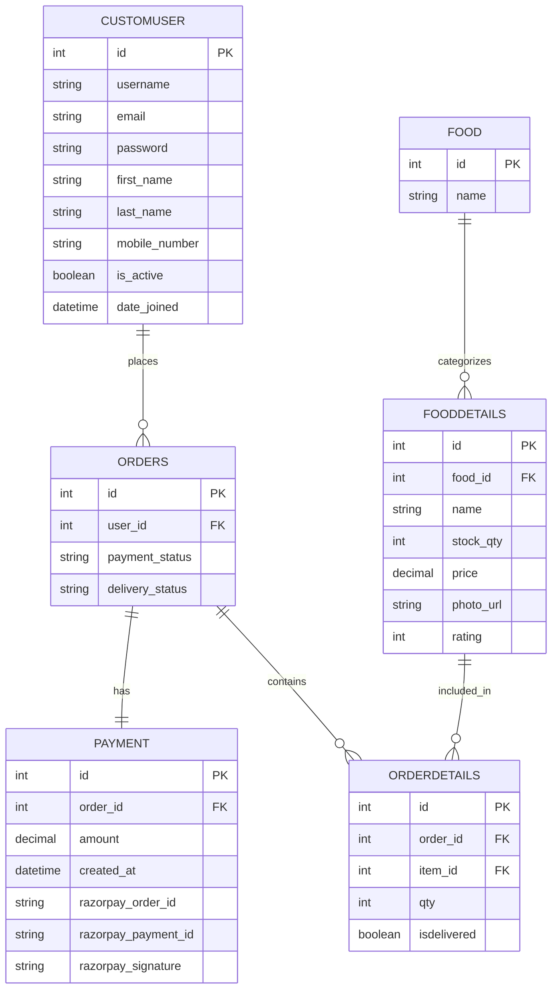

# 🍽️ Canteen Management System

A comprehensive web-based canteen management system built with Django that streamlines food ordering, payment processing, and administrative operations for institutional canteens.


## 🌟 Features

### Customer Features
- **User Authentication**: Secure registration and login system
- **Browse Menu**: View available food items with ratings and pricing
- **Cart Management**: Add, remove, and modify items in cart
- **Order Placement**: Easy ordering with real-time stock checking
- **Payment Integration**: Razorpay payment gateway integration (Required for order processing)

### Admin Features
- **Inventory Management**: Add, edit, and manage food items and stock
- **Order Management**: View and update order status
- **User Management**: Manage customer accounts and details

### Technical Features
- **RESTful API**: Complete API with Django REST Framework
- **Responsive Design**: Mobile-friendly interface
- **Cloud Deployment**: Vercel deployment configuration
- **Database**: PostgreSQL for all environments
- **Payment Gateway**: Integrated Razorpay for secure payments

## 🏗️ Architecture

```
┌─────────────────┐    ┌─────────────────┐    ┌─────────────────┐
│   Frontend      │    │   Backend       │    │   Database      │
│   (Templates)   │◄──►│   (Django)      │◄──►│  (PostgreSQL)   │
│   HTML/CSS/JS   │    │   REST API      │    │   Models        │
└─────────────────┘    └─────────────────┘    └─────────────────┘
```

## 🚀 Quick Start

> **Note**: This application uses PostgreSQL as the database. Ensure you have PostgreSQL installed and running before proceeding with the setup.

### Prerequisites
- Python 3.8+
- PostgreSQL 12+
- pip (Python package manager)
- Git

### Installation

1. **Clone the repository**
   ```bash
   git clone https://github.com/yourusername/canteen.git
   cd canteen
   ```

2. **Create and activate virtual environment**
   ```bash
   # Windows
   python -m venv venv
   venv\Scripts\activate

   # Linux/Mac
   python3 -m venv venv
   source venv/bin/activate
   ```

3. **Install dependencies**
   ```bash
   pip install -r requirements.txt
   ```

4. **Environment Configuration**
   Create a `.env` file in the root directory:
   ```env
   # Django Configuration
   SECRET_KEY=your-secret-key-here
   DEBUG=True
   ALLOWED_HOSTS=localhost,127.0.0.1
   
   # Database Configuration (PostgreSQL)
   DB_HOST=localhost
   DB_NAME=canteen_db
   DB_USER=your_db_username
   DB_PASSWORD=your_db_password
   DB_PORT=5432
   
   # Razorpay Configuration (Required)
   RAZORPAY_KEY_ID=your-razorpay-key-id
   RAZORPAY_KEY_SECRET=your-razorpay-key-secret
   ```

5. **Database Setup**
   First, create a PostgreSQL database:
   ```sql
   CREATE DATABASE canteen_db;
   CREATE USER your_db_username WITH PASSWORD 'your_db_password';
   GRANT ALL PRIVILEGES ON DATABASE canteen_db TO your_db_username;
   ```
   
   Then run Django migrations:
   ```bash
   python manage.py makemigrations
   python manage.py migrate
   ```

6. **Create Superuser**
   ```bash
   python manage.py createsuperuser
   ```

7. **Run the Development Server**
   ```bash
   python manage.py runserver
   ```

8. **Access the Application**
   - Main Application: http://127.0.0.1:8000/
   - Admin Panel: http://127.0.0.1:8000/admin/
   - API Endpoints: http://127.0.0.1:8000/api/

## 📱 Usage

### For Customers
1. **Register/Login**: Create an account or login with existing credentials
2. **Browse Menu**: View available food items and their details
3. **Add to Cart**: Select items and quantities
4. **Place Order**: Proceed to checkout and payment

### For Administrators
1. **Access Admin Panel**: Login with superuser credentials
2. **Manage Inventory**: Add/edit food items and stock levels
3. **Process Orders**: Update order and delivery status

## 🛠️ Tech Stack

### Backend
- **Framework**: Django 4.1.13
- **API**: Django REST Framework
- **Database**: PostgreSQL
- **Authentication**: Django's built-in auth system
- **Payment**: Razorpay Integration (Required)

### Frontend
- **Templates**: Django Templates
- **Styling**: CSS3, Bootstrap
- **JavaScript**: Vanilla JS for interactivity
- **Icons**: Font Awesome

### Deployment
- **Platform**: Vercel
- **Static Files**: WhiteNoise
- **Environment**: Python 3.12

## 📊 Database Schema

### Entity Relationship Diagram


```mermaid
erDiagram
    CUSTOMUSER {
        int id PK
        string username
        string email
        string password
        string first_name
        string last_name
        string mobile_number
        boolean is_active
        datetime date_joined
    }
    
    FOOD {
        int id PK
        string name
    }
    
    FOODDETAILS {
        int id PK
        int food_id FK
        string name
        int stock_qty
        decimal price
        string photo_url
        int rating
    }
    
    ORDERS {
        int id PK
        int user_id FK
        string payment_status
        string delivery_status
    }
    
    ORDERDETAILS {
        int id PK
        int order_id FK
        int item_id FK
        int qty
        boolean isdelivered
    }
    
    PAYMENT {
        int id PK
        int order_id FK
        decimal amount
        datetime created_at
        string razorpay_order_id
        string razorpay_payment_id
        string razorpay_signature
    }
    
    CUSTOMUSER ||--o{ ORDERS : "places"
    ORDERS ||--|| PAYMENT : "has"
    ORDERS ||--o{ ORDERDETAILS : "contains"
    FOOD ||--o{ FOODDETAILS : "categorizes"
    FOODDETAILS ||--o{ ORDERDETAILS : "included_in"
```

### Model Relationships

#### 🔗 **Relationship Overview**
- **CustomUser** → **Orders**: One-to-Many (One user can have multiple orders)
- **Orders** → **Payment**: One-to-One (Each order has one payment record)
- **Orders** → **OrderDetails**: One-to-Many (One order can contain multiple items)
- **Food** → **FoodDetails**: One-to-Many (One category can have multiple food items)
- **FoodDetails** → **OrderDetails**: One-to-Many (One food item can be in multiple orders)

### Core Models Details

#### 👤 **CustomUser**
Extended Django User model for customer management
```python
Fields:
├── id (Primary Key)
├── username (Unique identifier)
├── email (Email address)
├── password (Encrypted password)
├── first_name, last_name (User details)
├── mobile_number (Contact information)
├── is_active (Account status)
└── date_joined (Registration timestamp)

Relationships:
└── orders (One-to-Many with Orders)
```

#### 🍽️ **Food**
Food category classification
```python
Fields:
├── id (Primary Key)
└── name (Category name: Breakfast, Lunch, Snacks, etc.)

Relationships:
└── food_details (One-to-Many with FoodDetails)
```

#### 🥘 **FoodDetails**
Detailed food item information with inventory
```python
Fields:
├── id (Primary Key)
├── food_id (Foreign Key → Food)
├── name (Item name)
├── stock_qty (Available quantity)
├── price (Item price)
├── photo_url (Item image URL)
└── rating (Customer rating 0-5)

Relationships:
├── food (Many-to-One with Food)
└── order_details (One-to-Many with OrderDetails)
```

#### 📋 **Orders**
Customer order management
```python
Fields:
├── id (Primary Key)
├── user_id (Foreign Key → CustomUser)
├── payment_status (Pending/Paid)
└── delivery_status (Pending/Delivered)

Relationships:
├── user (Many-to-One with CustomUser)
├── payment (One-to-One with Payment)
└── order_details (One-to-Many with OrderDetails)
```

#### 🛒 **OrderDetails**
Individual items within an order
```python
Fields:
├── id (Primary Key)
├── order_id (Foreign Key → Orders)
├── item_id (Foreign Key → FoodDetails)
├── qty (Quantity ordered)
└── isdelivered (Delivery status per item)

Relationships:
├── order (Many-to-One with Orders)
└── item (Many-to-One with FoodDetails)
```

#### 💳 **Payment**
Payment transaction records
```python
Fields:
├── id (Primary Key)
├── order_id (Foreign Key → Orders, One-to-One)
├── amount (Payment amount)
├── created_at (Payment timestamp)
├── razorpay_order_id (Razorpay order reference)
├── razorpay_payment_id (Razorpay payment reference)
└── razorpay_signature (Payment verification signature)

Relationships:
└── order (One-to-One with Orders)
```

### 🔄 **Data Flow**

1. **User Registration**: Creates `CustomUser` record
2. **Browse Menu**: Fetches `Food` categories and `FoodDetails`
3. **Place Order**: Creates `Orders` record linked to user
4. **Add Items**: Creates multiple `OrderDetails` records for each item
5. **Payment Processing**: Creates `Payment` record with Razorpay integration
6. **Order Fulfillment**: Updates `delivery_status` in `Orders` and `isdelivered` in `OrderDetails`

## 🔧 API Endpoints

### Authentication
```
POST /api/auth/register/     # User registration
POST /api/auth/login/        # User login
POST /api/auth/logout/       # User logout
```

### Food Management
```
GET    /api/food/            # List all food categories
GET    /api/fooddetails/     # List all food items
POST   /api/fooddetails/     # Create new food item (Admin)
PUT    /api/fooddetails/{id} # Update food item (Admin)
DELETE /api/fooddetails/{id} # Delete food item (Admin)
```

### Order Management
```
GET  /api/orders/            # List user orders
POST /api/orders/            # Create new order
PUT  /api/orders/{id}        # Update order status
GET  /api/orderdetails/      # List order details
```

### Payment
```
GET  /api/payments/          # List payments
POST /api/payments/          # Process payment
```

##  Project Structure

```
Canteen/
├── manage.py                 # Django management script
├── requirements.txt          # Python dependencies
├── vercel.json              # Vercel deployment config
├── build_files.sh           # Build script
├── db.sqlite3               # Development database (if using SQLite locally)
├── .env                     # Environment variables (create this)
│
├── vercel_app/              # Main Django project
│   ├── settings.py          # Django settings
│   ├── urls.py              # Main URL configuration
│   ├── wsgi.py              # WSGI application
│   └── asgi.py              # ASGI application
│
├── canteen/                 # Main app (frontend & core logic)
│   ├── models.py            # Database models
│   ├── views.py             # View functions
│   ├── urls.py              # URL patterns
│   ├── forms.py             # Django forms
│   └── migrations/          # Database migrations
│
├── database/                # API app
│   ├── models.py            # API models
│   ├── views.py             # API views
│   ├── serializers.py       # DRF serializers
│   └── migrations/          # Database migrations
│
├── admin_panel/             # Admin interface app
│   ├── models.py            # Admin models
│   ├── views.py             # Admin views
│   └── urls.py              # Admin URL patterns
│
├── templates/               # HTML templates
│   ├── base.html            # Base template
│   ├── index.html           # Home page
│   ├── login.html           # Login page
│   ├── register.html        # Registration page
│   ├── cart.html            # Shopping cart
│   ├── payment.html         # Payment page
│   └── admin_panel/         # Admin templates
│
├── static/                  # Static files
│   ├── style.css            # Main stylesheet
│   ├── loginsinup.png       # Login image
│   └── mealminder.jpg       # Brand image
│
└── staticfiles_build/       # Compiled static files (production)
```

## 🤝 Contributing

1. Fork the repository
2. Create a feature branch (`git checkout -b feature/AmazingFeature`)
3. Commit your changes (`git commit -m 'Add some AmazingFeature'`)
4. Push to the branch (`git push origin feature/AmazingFeature`)
5. Open a Pull Request

## 📝 License

This project is licensed under the MIT License - see the [LICENSE](LICENSE) file for details.

## 👨‍💻 Developer

**Your Name**
- GitHub: [@lakhman108](https://github.com/lakhman108)
- LinkedIn: [LinkedIn](https://linkedin.com/in/parmar-lakhman-5a876825b)
- Email: luckyparmar737@gmail.com

## 🙏 Acknowledgments

- Django community for the excellent framework
- Razorpay for payment gateway integration
- Bootstrap for responsive design components
- Font Awesome for icons

## 📞 Support

If you have any questions or need help with setup, please:
1. Check the [Issues](https://github.com/lakhman108/canteen/issues) page
2. Create a new issue if your problem isn't already reported
3. Contact the developer directly

---

**⭐ Star this repository if you found it helpful!**
